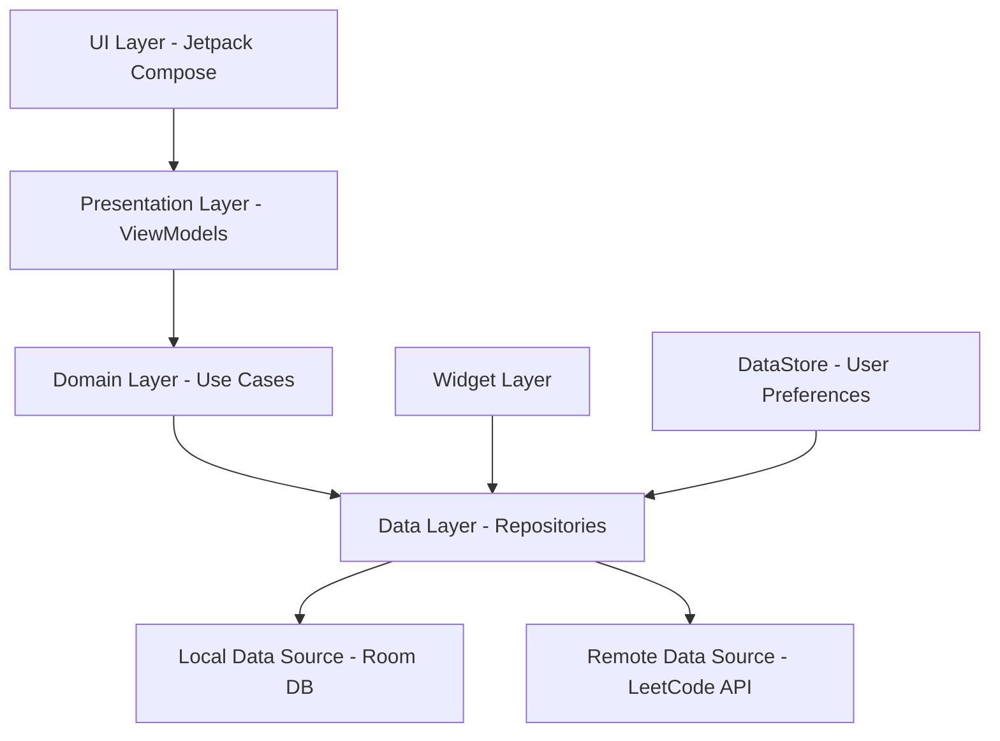

# Ken - LeetCode Progress Tracker & Analytics 🚀

[](https://play.google.com/store/apps/details?id=com.devrachit.ken)
[](https://android-arsenal.com/api?level=26)
[](https://kotlinlang.org)
[](https://developer.android.com)

<div align="center">

[](https://play.google.com/store/apps/details?id=com.devrachit.ken)

</div>

A comprehensive Android application built with **Jetpack Compose** and **Clean Architecture** that
helps developers track their LeetCode progress, compare with others, and visualize their coding
journey through beautiful analytics and widgets.

## ✨ Features

### 📊 Dashboard & Analytics

- **Question Progress Tracking**: Visual representation of solved problems categorized by
  difficulty (Easy, Medium, Hard)
- **Activity Heatmap**: GitHub-style contribution calendar showing daily coding activity
- **Contest Performance**: Rating history and participation analytics
- **Streak Tracking**: Current solving streak and total active days
- **Recent Submissions**: Timeline of latest problem solutions
- **Badges Collection**: Display of earned LeetCode achievements

### 👥 User Comparison

- **Side-by-Side Comparison**: Compare progress between any two users
- **Detailed Analytics**: Progress graphs for each difficulty level
- **Activity Comparison**: Visual comparison of coding activity patterns
- **Contest Performance**: Compare rating progression and contest participation
- **Interactive Charts**: Beautiful MPAndroidChart visualizations

### 🏠 Home Screen Widgets

- **Simple Text Widget**: Quick stats display on home screen
- **Progress Widgets**: Large and small segmented progress indicators
- **Streak Widget**: Display current streak and activity
- **Real-time Updates**: Automatic widget refresh with latest data

### 🔐 Authentication & User Management

- **Simple Authentication**: Easy sign-in process with no password requirements
- **Multi-User Support**: Switch between multiple LeetCode profiles
- **Data Persistence**: Local caching with Room database
- **Offline Mode**: Access cached data without internet

### 🎨 Modern UI/UX

- **Material Design 3**: Latest design system implementation
- **Dark Theme**: Eye-friendly dark mode interface
- **Smooth Animations**: Fluid transitions and micro-interactions
- **Pull-to-Refresh**: Intuitive data refresh mechanism
- **Responsive Design**: Optimized for different screen sizes

## 📱 Screenshots & Videos

### App Screenshots

<!-- Add your screenshots here -->


<!--  -->


## 🏗️ Project Structure

```
app/
├── src/main/java/com/devrachit/ken/
│   ├── data/                           # Data Layer
│   │   ├── local/                      # Local data sources
│   │   │   ├── dao/                    # Room DAOs
│   │   │   ├── databases/              # Room database
│   │   │   ├── datastore/              # DataStore preferences
│   │   │   └── entity/                 # Room entities
│   │   ├── remote/                     # Remote data sources
│   │   │   ├── queries/                # GraphQL queries
│   │   │   └── services/               # API services
│   │   └── repository/                 # Repository implementations
│   │       ├── local/                  # Local repository
│   │       └── remote/                 # Remote repository
│   ├── di/                             # Dependency Injection (Hilt)
│   ├── domain/                         # Domain Layer
│   │   ├── models/                     # Domain models
│   │   ├── policy/                     # Business policies
│   │   └── repository/                 # Repository interfaces
│   ├── presentation/                   # Presentation Layer
│   │   ├── navigation/                 # Navigation components
│   │   └── screens/                    # UI screens
│   │       ├── auth/                   # Authentication screens
│   │       │   └── onboarding/         # Onboarding flow
│   │       └── dashboard/              # Main app screens
│   │           ├── home/               # Home screen
│   │           ├── compare/            # User comparison
│   │           ├── compareusers/       # Compare users screen
│   │           ├── questions/          # Questions screen
│   │           ├── sheets/             # Sheets screen
│   │           ├── userdetails/        # User details
│   │           └── Widgets/            # Dashboard widgets
│   ├── ui/                             # UI components and theme
│   ├── utility/                        # Utility classes
│   └── widget/                         # Home screen widgets
│       ├── SegmentedProgressLarge/     # Large progress widget
│       ├── SegmentedProgressSmall/     # Small progress widget
│       └── streakWidget/               # Streak display widget
├── schemas/                            # Room database schemas
├── dev/                                # Development build configs
├── staging/                            # Staging build configs
└── prod/                               # Production build configs
```

## 🔄 Data Flow Architecture

The app follows **Clean Architecture** principles with clear separation of concerns:



### Data Flow Details:

1. **UI Layer (Presentation)**
   - Jetpack Compose screens and components
   - State management with ViewModels
   - Navigation handling

2. **Domain Layer**
   - Business logic and use cases
   - Repository interfaces
   - Domain models and entities

3. **Data Layer**
   - Repository implementations
   - Local caching with Room database
   - Remote API calls to LeetCode GraphQL
   - Data synchronization and caching policies

4. **Widget Layer**
   - Home screen widget providers
   - Widget update receivers
   - Real-time data binding

## 🛠️ Tech Stack

### Core Technologies

- **Language**: Kotlin 100%
- **UI Framework**: Jetpack Compose
- **Architecture**: Clean Architecture + MVVM
- **Dependency Injection**: Hilt
- **Navigation**: Compose Navigation

### Data & Networking

- **Local Database**: Room
- **Preferences**: DataStore
- **HTTP Client**: Ktor + Retrofit
- **JSON Parsing**: Gson + Kotlinx Serialization
- **Image Loading**: Coil

### UI & Design

- **Material Design**: Material3
- **Charts**: MPAndroidChart
- **Animations**: Compose Animations
- **Shimmer Effects**: Shimmer Library
- **Dimensions**: SDP (Scalable DP)

### Firebase & Analytics

- **Crashlytics**: Error reporting
- **Analytics**: User behavior tracking
- **Remote Config**: Feature flags
- **Performance**: App performance monitoring

### Development Tools

- **Build System**: Gradle Kotlin DSL
- **Code Quality**: KSP (Kotlin Symbol Processing)
- **Debugging**: Chucker (HTTP inspector)
- **Version Control**: Git

## 🚀 Getting Started

### Prerequisites

- Android Studio Hedgehog | 2023.1.1 or later
- JDK 11 or higher
- Android SDK API 26+
- Git

### Installation

1. **Clone the repository**
   ```bash
   git clone https://github.com/rockyhappy/ken
   cd ken
   ```

2. **Open in Android Studio**
   - Open Android Studio
   - Select "Open an existing project"
   - Navigate to the cloned directory

3. **Configure Firebase**
   - Add your `google-services.json` files to:
      - `app/src/dev/` (for development)
      - `app/src/staging/` (for staging)
      - `app/src/prod/` (for production)

4. **Build the project**
   ```bash
   ./gradlew build
   ```

5. **Run the app**
   ```bash
   ./gradlew installDevDebug  # For development build
   ```

### Build Variants

The project supports multiple build variants:

- **Development** (`dev`): For development with debug features
- **Staging** (`staging`): For testing with production-like environment
- **Production** (`prod`): For release builds

## 📦 Key Dependencies

```kotlin
// Core Android
androidx.core:core-ktx
androidx.lifecycle:lifecycle-runtime-ktx
androidx.activity:activity-compose

// Compose
androidx.compose.bom
androidx.compose.ui
androidx.compose.material3
androidx.navigation:navigation-compose

// Architecture
androidx.hilt:hilt-compose-navigation
com.google.dagger:hilt-android

// Database
androidx.room:room-runtime
androidx.room:room-ktx

// Networking
com.squareup.retrofit2:retrofit
com.squareup.okhttp3:okhttp
io.ktor:ktor-client-core

// UI
io.coil-kt:coil-compose
com.github.PhilJay:MPAndroidChart
com.facebook.shimmer:shimmer

// Firebase
com.google.firebase:firebase-bom
com.google.firebase:firebase-crashlytics
com.google.firebase:firebase-analytics
```

## 🎯 Features in Detail

### Dashboard Analytics

- **Progress Visualization**: Circular progress indicators showing solved problems by difficulty
- **Streak Tracking**: Current solving streak with historical data
- **Activity Heatmap**: Year-view contribution calendar
- **Contest Analysis**: Rating progression and participation metrics

### User Comparison

- **Multi-User Analysis**: Compare any two LeetCode profiles
- **Progress Comparison**: Side-by-side difficulty-wise progress
- **Activity Analysis**: Compare coding patterns and streaks
- **Visual Charts**: Interactive comparison charts

### Home Widgets

- **Simple Stats**: Basic progress display
- **Detailed Progress**: Segmented progress indicators
- **Streak Display**: Current streak and activity metrics
- **Auto-Refresh**: Real-time data updates

## 🔧 Configuration

### API Configuration

The app uses LeetCode's GraphQL API. No additional API keys required.

### Firebase Configuration

1. Create a Firebase project
2. Add Android app with package name `com.devrachit.ken`
3. Download and add `google-services.json` files
4. Enable required services (Analytics, Crashlytics, Remote Config)

### Build Configuration

Customize build variants in `app/build.gradle.kts`:

- Application ID suffixes
- Version codes and names
- Signing configurations
- ProGuard rules

## 📄 License

```
Copyright 2024 Ken - LeetCode Progress Tracker

Licensed under the Apache License, Version 2.0 (the "License");
you may not use this file except in compliance with the License.
You may obtain a copy of the License at

    http://www.apache.org/licenses/LICENSE-2.0

Unless required by applicable law or agreed to in writing, software
distributed under the License is distributed on an "AS IS" BASIS,
WITHOUT WARRANTIES OR CONDITIONS OF ANY KIND, either express or implied.
See the License for the specific language governing permissions and
limitations under the License.
```

## 🤝 Contributing

Contributions are welcome! Please feel free to submit a Pull Request. For major changes, please open
an issue first to discuss what you would like to change.

1. Fork the Project
2. Create your Feature Branch (`git checkout -b feature/AmazingFeature`)
3. Commit your Changes (`git commit -m 'Add some AmazingFeature'`)
4. Push to the Branch (`git push origin feature/AmazingFeature`)
5. Open a Pull Request

## 📞 Support

- **App Store
  **: [Download Ken on Play Store](https://play.google.com/store/apps/details?id=com.devrachit.ken)
- **Issues**: Create an issue for bug reports or feature requests
- **Email**: Contact developer for support

## 🎉 Acknowledgments

- LeetCode for providing the GraphQL API
- Android team for Jetpack Compose
- Firebase team for comprehensive mobile platform
- Open source community for amazing libraries

---

Made with ❤️ by Rachit Katiyar

<div align="center">

[](https://play.google.com/store/apps/details?id=com.devrachit.ken)

</div>
